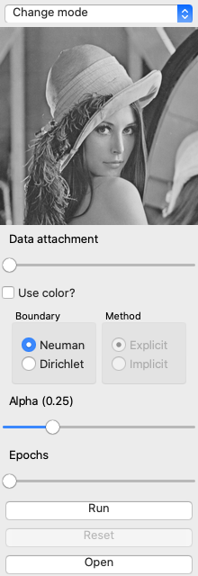

# IMT3881 2020 Prosjekt

	

## Sjekkliste før innlevering
* [x]  automatiserte (enhets)tester med tilhørende rapportering
* [ ]  gode variabelnavn
* [ ]  struktur og gjenbruk av kode
* [ ]  gjenbrukbarhet i form av moduler
* [ ]  dokumentasjon i form av velformede doc-strings
 
## Praktisk gjennømføring
* Lag en _fork_ av dette repoet. Sørg for at
    - det forkede repoet er privat
	- emneansvarlig har lesetilgang ('reporter')
* La både kode og rapport bo i repoet under katalogene _src_ og
  _rapport_.
* Bruk saksbehandlingssystem og kanban-tavle i GitLab
* Sørg for jevnlige commits. Dette dokumenterer arbeidsprosessen. Bruk smart commits for å lenke commits til sakene i saksbehandlingssystemet.
* Levér inn rapport som PDF i Inspera. PDF-en må inneholde URL-en
  til repoet.

## Oppgave

Se oppgavebeskrivelse i katalogen _oppgave_.
